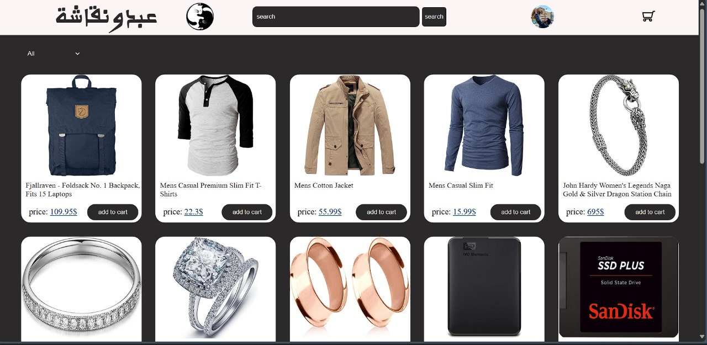
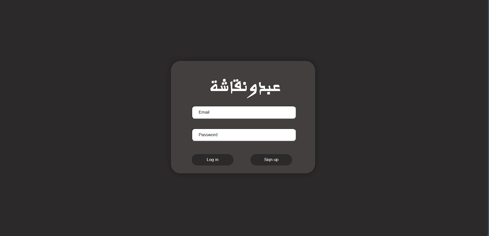
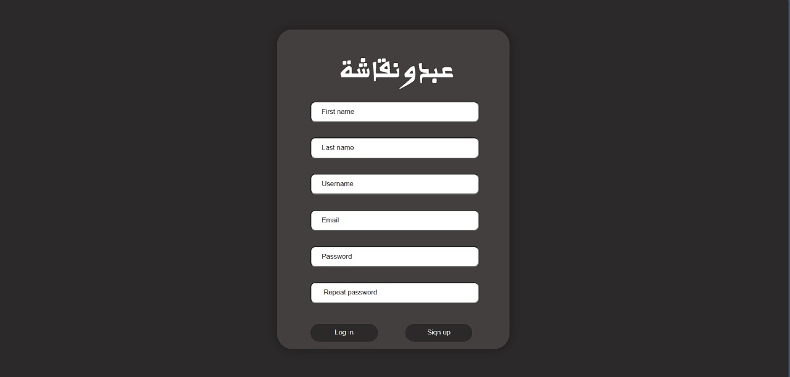
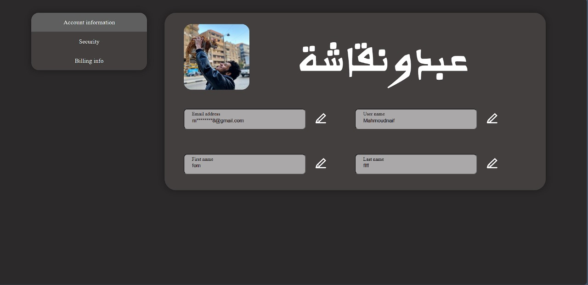

# Shopping Website Project

This repository contains the source code for an e-commerce shopping website, including HTML, JavaScript, and CSS files. The project is designed to provide an interactive shopping experience for users.

## Table of Contents

- [Contents](#contents)
    - [Main Page](#main-page)
    - [Account Center](#account-center)
    - [Login Page](#login-page)
- [Pages](#pages)
    - [Main Page](#main-page)
    - [Account Center](#account-center)
    - [Login Page](#login-page)
- [HTML Files](#html-files)
    - [Usage](#usage)
    - [Stylesheets](#stylesheets)
- [JavaScript Files](#javascript-files)
- [Screenshots](#screenshots)
- [Contact](#contact)

## Contents

- **Main Page**: The primary page of the shopping website that provides an overview of available products and a search feature.
- **Account Center**: The page where users can manage their account information, security settings, and billing information.
- **Login Page**: The page where users can enter their credentials to log in or sign up for an account.

## Pages

### Main Page

- **Description**: This page is the entry point to the shopping website. It includes a header with the website logo, a search bar, and links to the user's account and shopping cart. The main area of the page displays products that users can browse and add to their cart.
- **Usage**: Users can navigate to this page to browse products, search for specific items, and interact with the shopping cart.

### Account Center

- **Description**: This page allows users to manage their account information, including personal details, security settings, and billing information. It provides a user-friendly interface for updating account preferences.
- **Usage**: Users can navigate to this page from the main page to update their account details and manage their settings.

### Login Page

- **Description**: This page provides a form for users to enter their email and password to log in. Users can also find a sign-up button if they do not have an account yet.
- **Usage**: Users can navigate to this page to log in to their accounts or create a new account.

## HTML Files

- **accountcenter.html**: Represents the account center page where users can view and manage their account information, security settings, and billing information.
- **mainpage.html**: Represents the main page of the shopping website, including the header, search bar, and product display area.
- **loggingin.html**: Represents the login page where users can enter their credentials to log in or sign up for an account.

### Usage

- **accountcenter.html**: Load this file when the user wants to access their account information.
- **mainpage.html**: Load this file as the main entry point for the shopping website.
- **loggingin.html**: Load this file when the user needs to log in or sign up for an account.

### Stylesheets

- **`CSS/general.css`**: General styles for the website.
- **`CSS/accountcenter.css`**: Styles specific to the account center page.
- **`CSS/header.css`**: Styles for the header section.
- **`CSS/mainpage.css`**: Styles specific to the main page.
- **`CSS/filter-area.css`**: Styles for the filter area.
- **`CSS/loggingin.css`**: Styles specific to the login page.

## JavaScript Files

- **accountcenter.js**: Manages the account center page, handling user interactions and events for account-related functionalities such as viewing and updating account information.
- **data.js**: Contains data for the website, including user data and product information.
- **loggingarea.js**: Manages login functionality, handling user input, authentication, and redirection for the login page.
- **productsfetch.js**: Fetches product data from an API and manages the display of products on the main page.

These JavaScript files work together to support the different functionalities of the website, providing user interactivity and dynamic content management across the website's pages.

## Screenshots

- **Main Page**:

    
    - The main page shows the header, search bar, and product display area, allowing users to browse and search for products.

- **Signin Screen**:

    
    - The sign-in screen allows users to log in to their accounts to access personalized features.

- **Signup Screen**:

    
    - The sign-up screen allows users to create new accounts to access the website's features.

- **Account Information**:

    
    - The account information page allows users to view and manage their personal information, security settings, and billing details.

## Contact

For any questions or feedback, You can contact me via email at [mahmoudnaif788@gmail.com](mailto:mahmoudnaif788@gmail.com).
